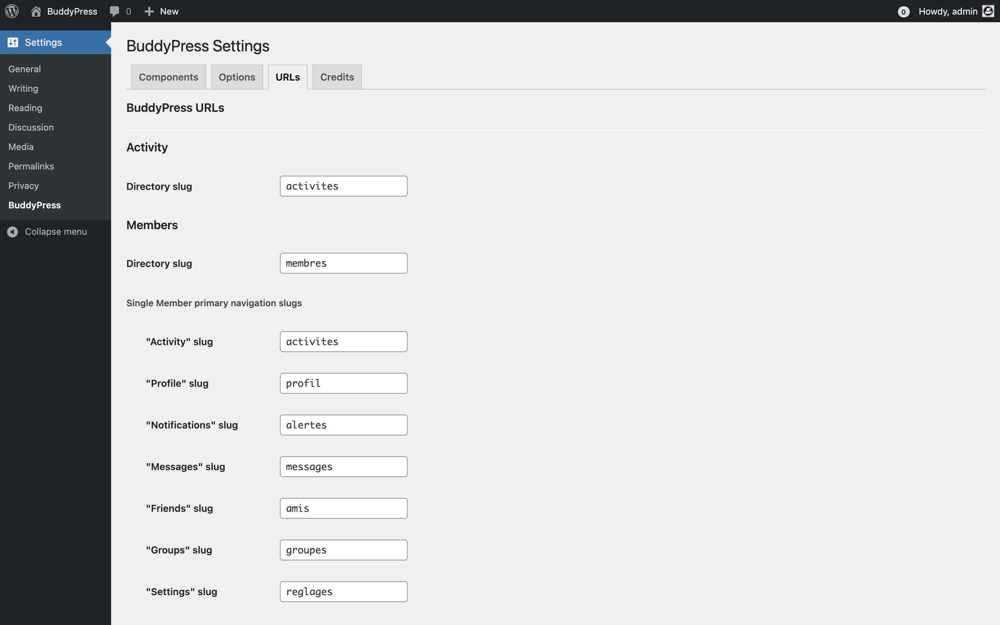

# BuddyPress Rewrites

[8 years ago](https://buddypress.trac.wordpress.org/ticket/4954), we started working on migrating the BuddyPress’s custom URI parser in favor of the WordPress’s Rewrites API. To make concrete progress about this migration, we decided to use this **feature as a plugin** BuddyPress plugin. We hope doing so, you and many other contributors will help us achieve this very important goal for the BuddyPress open source project.

_PS: We plan to publish `BP Rewrites` to the [WordPress.org Plugins directory](https://wordpress.org/plugins/) as soon as we're happy with the plugin's behavior._ 😃

## Goal
Migrate BP's custom URI parser to use WP's Rewrite API. See [#4954](https://buddypress.trac.wordpress.org/ticket/4954) for more information.

## Benefits
+ BuddyPress URLs customization improved and easier.
+ Compatibility with plain permalinks.
+ Improved Compliance with WordPress Standards.
+ Improved User/Advanded user/Plugin developer/Theme designer BuddyPress experience.

## Requirements
- Backward compatibility with BuddyPress plugins/themes/codes using the BuddyPress’s ~~custom~~ Legacy URI parser.
- As many as possible Users/Advanded users/Plugin developers/Theme designers involved in TESTING this BuddyPress **feature as a plugin**.
